# Диаграммы PlantUML

---

## 1. Концептуальная схема

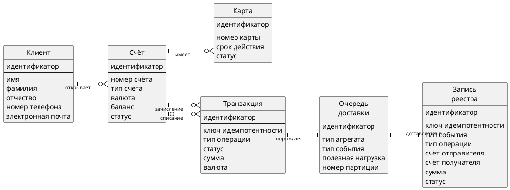

---

## 2. Структурная схема ПО

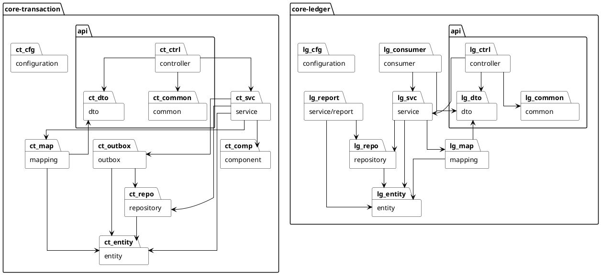

---

## 3. Диаграмма компонентов

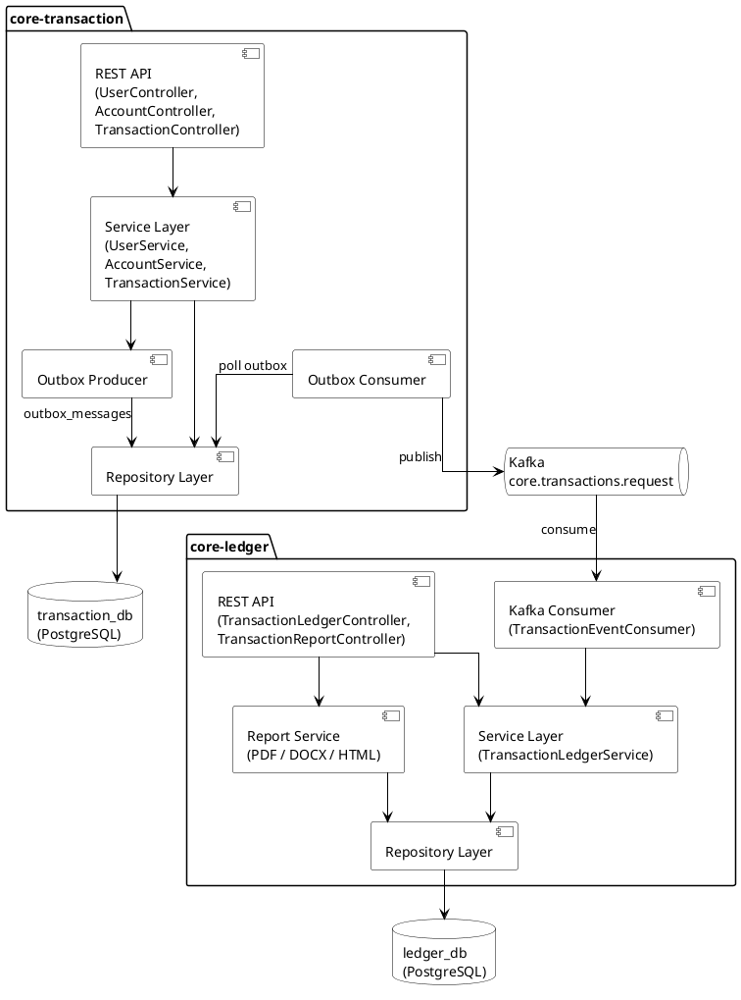

---

## 4. Диаграмма коопераций

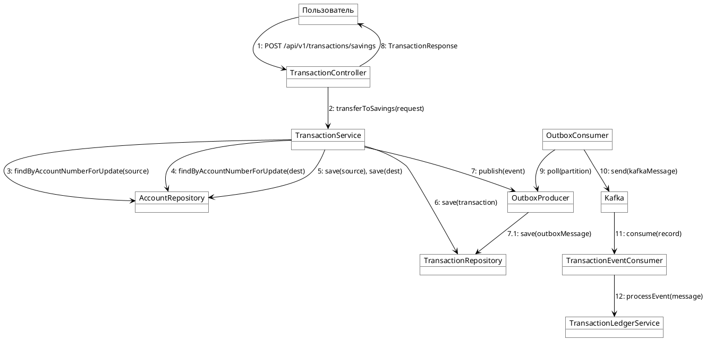

---

## 5. Диаграмма размещения

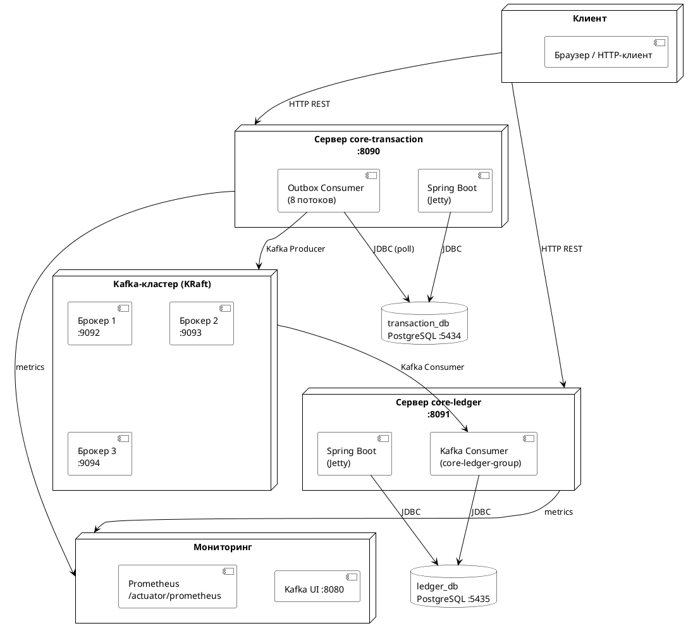

---

## 6. Диаграмма классов core-transaction

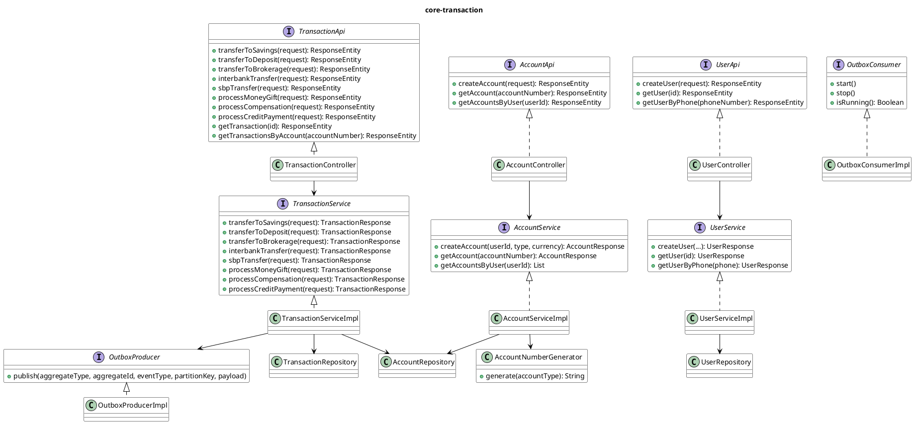

---

## 7. Диаграмма классов core-ledger

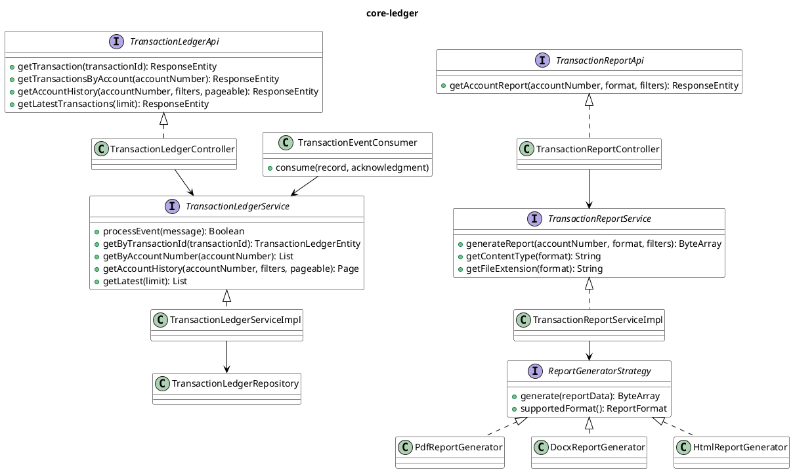

---

## 8. Диаграмма последовательности

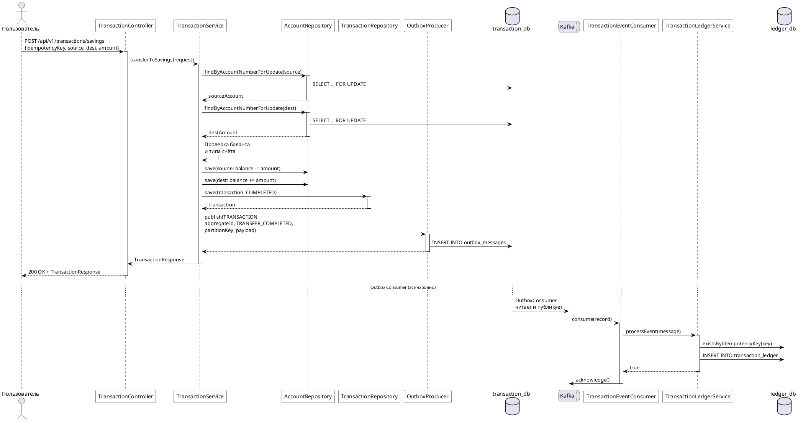

---

## 9. Диаграмма прецедентов

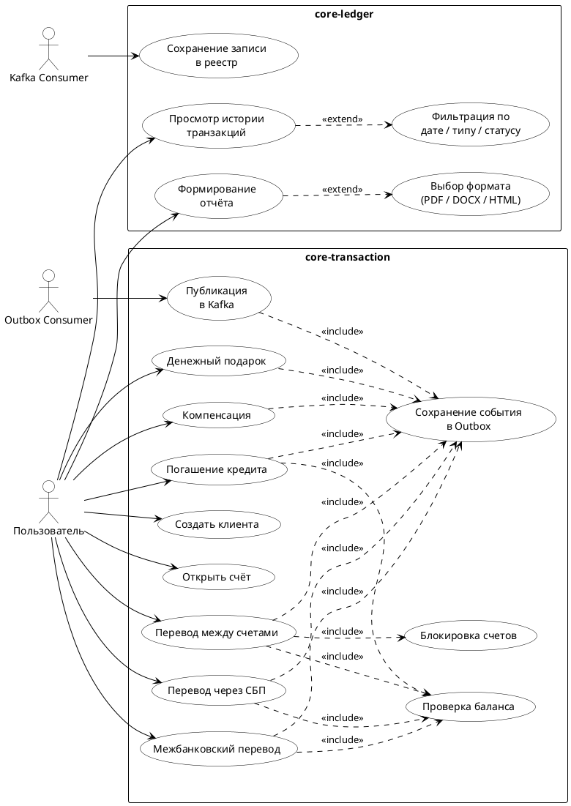

---

## 10. Функциональная модель проведения транзакций

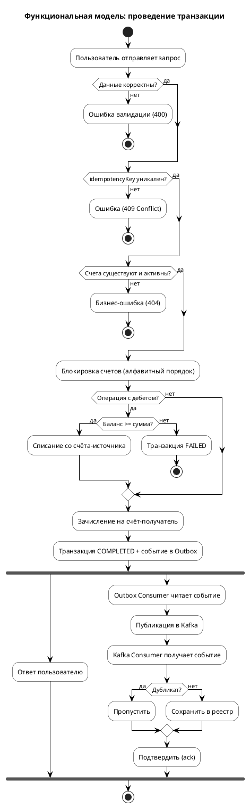

---

## 11. Расширенная диаграмма состояний

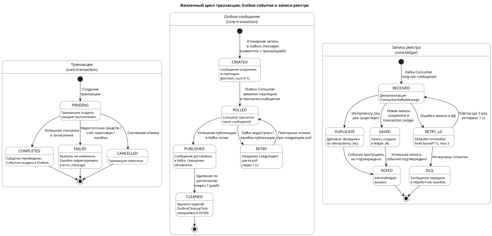

---

## 12. Диаграмма потоков данных

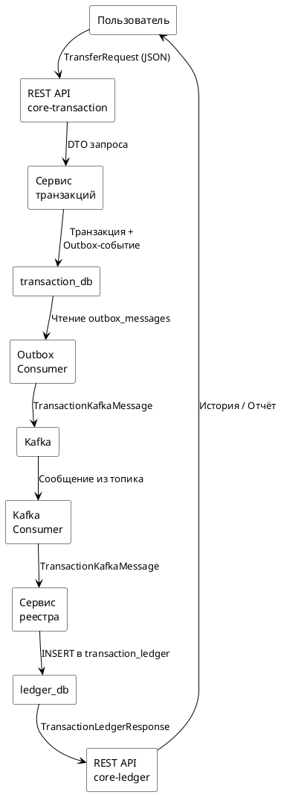

---

## 13. ER-диаграмма: transaction_db

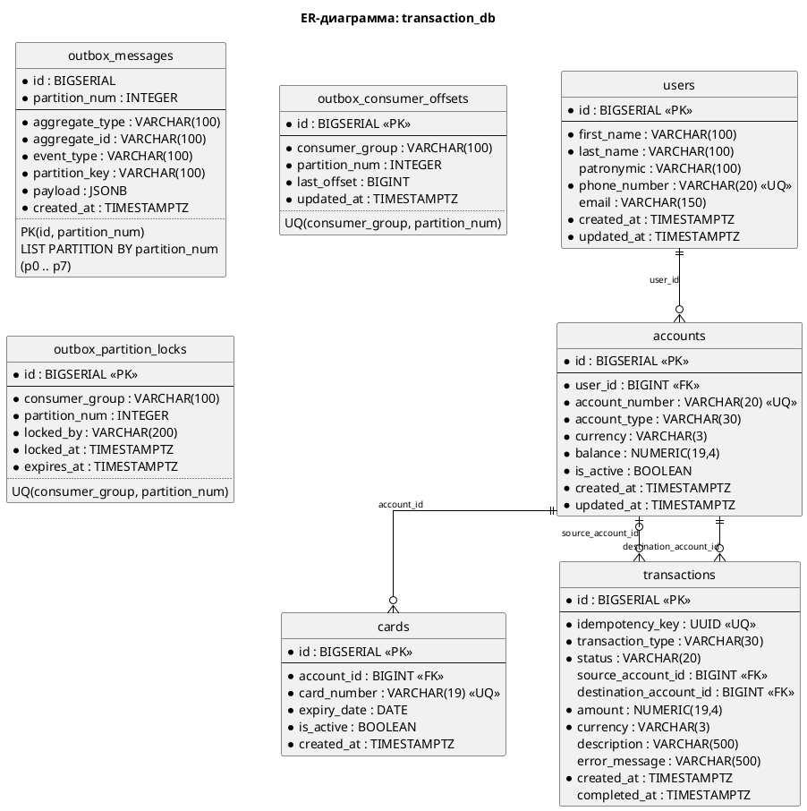

---

## 14. ER-диаграмма: ledger_db

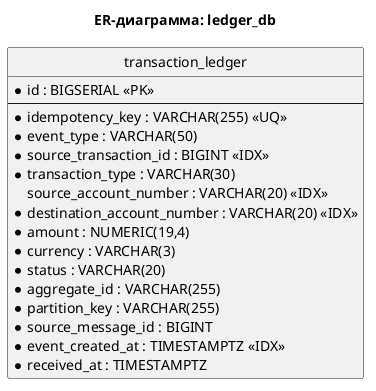

---

## 15. Алгоритм обработки финансовой транзакции (дебет-кредит)

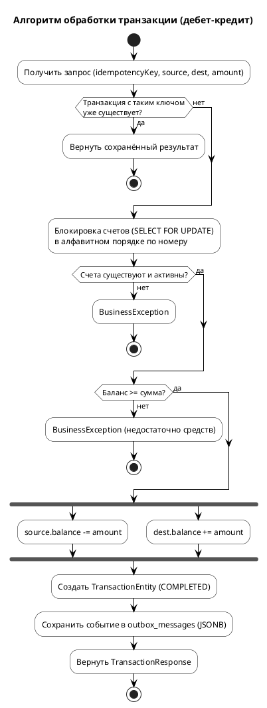

---

## 16. Алгоритм работы Outbox Consumer (цикл обработки одной партиции)

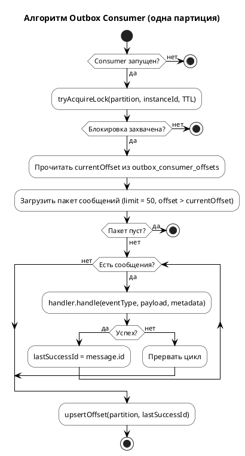

---

## 17. Алгоритм идемпотентного потребления Kafka-событий

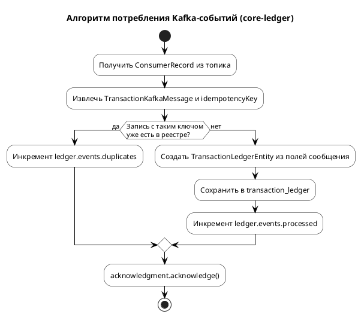

---

## 18. Алгоритм генерации номера счёта

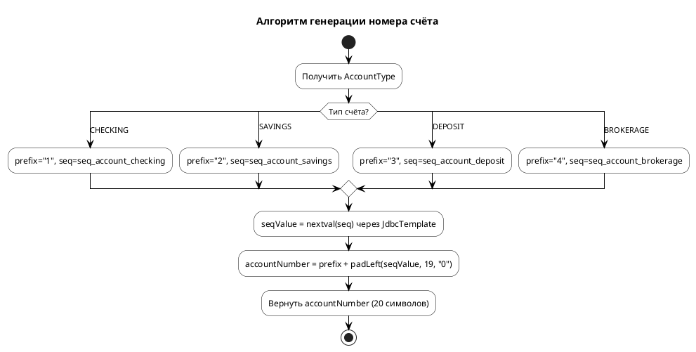
